# Sales Games

---


---

## Author: Juan Carlos González
## Email: jcgi.laboral@gmail.com

---

## Date: August, 2024

---

## Content

1.	Theme

2.	Development Methodology

3.	Data Extraction

4.	Data Clean

5.	Data Modeling

6.	Exploratory Data Analysis (AED)

8.	Conclusion

9.	Bibliography


---

## 1. Theme

### 1.1 Problem statement
The video game industry has seen significant growth, driven by the popularity of video games as forms of digital entertainment and the increase in the number of players. However, this growth presents significant challenges. The constant evolution of video games, driven by technological advances and changes in consumer habits, has created uncertainty about how to anticipate and adapt to changing market demands.
In addition, the lapse of the pandemic and confinement measures increased this trend, with a notable increase in the number of players using platforms such as Nintendo, Xbox and Playstation. This shift in consumer behavior has led to a 6.3% increase in the number of digital console users in the United States. The proliferation of smartphones and the development of technologies such as virtual reality have further expanded access to video games, attracting a new generation of gamers.
In this context of intense competitiveness and growing demand for innovation, companies in the sector face the challenge of keeping up with the expectations of the public and finding innovative ways to offer unique and engaging gaming experiences. The idea of the "metaverse" emerges as a possible solution, offering a virtual world in which users can create and share their own experiences. 

Therefore, the project proposes to develop a prediction tool that can accurately identify which styles of video games have the potential for success.

### 1.2 Objectives

•	Propose a development method for the extraction, cleaning, storage and analysis of data from successful and unsuccessful video games, considering variables such as genre, launch platform, user reviews, sales, among others.

•	Design a predictive model based on machine learning that can predict the potential for success of a video game based on its specific characteristics.

•	To evaluate the effectiveness of the prediction model by comparing the predictions with the actual performance of video games.

---

## 2. Development Methodology

To carry out the project, code modules will be developed for each of the points raised in the objectives so that it can be possible to establish the variables of the type of Genre and/or Platform of the Video Game to be developed and to be able to determine (experimentally) the sales prediction of that video game taking as a reference the variable copy of sales of the video game,  So, each task will be worked on as follows:

- Research the sources where the data for the project can be obtained.
- Extract data via Web Scraping
- Data Clean:
    - Data Upload
    - Pre-process the data.
    - Eliminate irrelevant variables.
    - Impute missing values.
    - Clean up the names of attributes that are not going to be used.

- Store the data in a database system
- Definition of the Target Variable(s).
- Generate a Supervised Predictive Model with an Algorithm of:

    - Regression: This algorithm can predict a continuous value (such as the overall sales of a video game). It is about finding a relationship between the input variables and the output variable that can be represented as a mathematical equation. The regression algorithms are: linear regression, polynomial regression and decision tree regression.

    - Classification: This algorithm can predict a category or class (such as the genre of a video game). It is about finding a decision boundary that separates the different classes in space from the input variables. The classification algorithms are: logistic regression, decision trees, support vector machines and neural networks.

    - Prediction: This algorithm is used to predict. The difference lies in the type of output variable that is being predicted.

- Evaluate the model.
- Implement the model.
- Perform an Exploratory Data Analysis to understand the distribution of the variables to achieve the objective of the project:

    - Global Sales Correlation Analysis by Console and Genre.
    - Analysis of Global Sales of Video Games by Platform.
    - Analysis of Global Sales by Gender.
    - Global Sales Analysis by Development Company.

---

### 3.2 What is Data Extraction

Data mining is a crucial process for any organization that wants to make the most of its information for decision-making. It allows data to be retrieved from various sources and transformed into a usable format for later analysis or storage. The data can come from databases, spreadsheets, websites, PDFs, emails, among others.

Data mining can be used to uncover hidden patterns or relationships within data to make informed decisions or create predictive models.

The methodology of data extraction involves the following steps:

- Identifying data sources: Determining where the necessary data comes from and which method to use for each source, such as SQL queries, APIs, or web scraping software.

- Establishing connections: Establishing connections with selected data sources using specific methods depending on the type of source.

- Query or Data Retrieval: Retrieve specific data using SQL queries, text extraction using OCR, or other techniques as needed.

- Data transformation and loading: Transform extracted data to comply with the required format, including data cleansing, normalization, and enrichment, and save it to a destination, such as flat files or databases.

For this step, the web scraping technique will be used with the Python version 3 programming language.
Web scraping is a technique used to extract data from websites in an automated manner. It allows information to be collected from web pages in a systematic way, converting unstructured data into a structured and usable format. 

To perform web scraping in Python, there are several useful libraries available are:

- **Beautiful Soup**: It is a Python library that is used to extract data from HTML and XML files. It provides simple methods for navigating and searching the analytics tree, which makes it very useful for data extraction from web pages.

- **Requests**: Although not specifically a web scraping library, Requests is an HTTP library for Python that allows HTTP requests to be made easily. It is very useful to download the HTML content of a web page before applying web scraping techniques with Beautiful Soup.

- **Selenium**: It is a powerful tool for automating web browsers. It can be useful for interacting with web pages that require JavaScript to load or perform dynamic actions. Selenium can control a web browser and simulate user interaction.

---
### 3.3 Data Extraction with Python
#### 1. To use these libraries, the following commands will be executed to install them in the Python language environment:

```python
!pip install pandas
!pip install HTML5lib
!pip install beautifulsoup4
!pip install requests
!pip install selenium
```
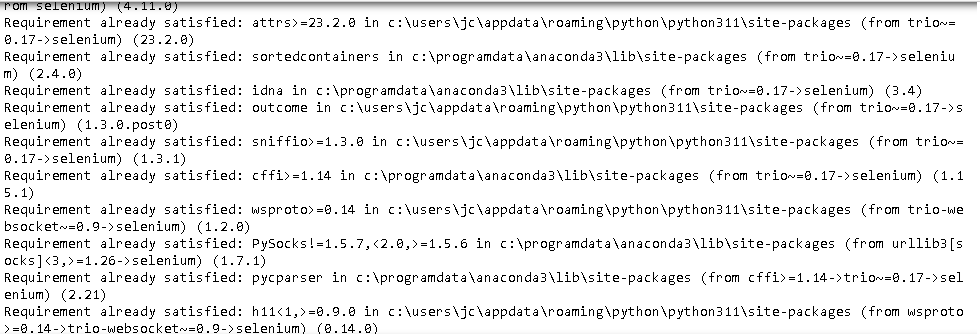

#### 2. Declare the bookstores 

```python
from selenium import webdriver
from bs4 import BeautifulSoup
Import pandas as PD
import time
```
#### 3. A dataframe is created to store the information that is extracted.

```python
#Crear an empty DataFrame to store the data
all_data = pd. DataFrame()
```

#### 4. The type of web browser driver that will be used to obtain the information is defined.

```python
# Specify the location of the Firefox driver
driver = webdriver. Firefox()
```

#### 5. A loop is created that will iterate through the range of page numbers to extract data from the MobyGames website. For each page number in the specified range, the code constructs a URL corresponding to that page, makes a GET request to the website using Selenium, waits for the JavaScript to generate the data table, parses the HTML content of the page using BeautifulSoup, finds the table that contains the data, and then saves itself to the Pandas DataFrame **all_data** from this table. Once iterates through all the pages, it closes the Selenium driver.


```python
# Iterate through a range of page numbers
# Suppose there are 10 pages
for i in range(1, 30):
    # Build the URL for the current page
    url = f"https://www.mobygames.com/game/sort:moby_score/page:{i}/"

    # Make a GET request to the website
    driver.get(url)

    # Wait for the JavaScript to generate the table (you may need to adjust the timeout)
    time.sleep(2)
    
    # Parsing page content with BeautifulSoup
    soup = BeautifulSoup(driver.page_source, 'html.parser')
    

    # Find the table in the page content
    table = soup.find('table')

    # Create a Pandas DataFrame from the table
    df = pd.read_html(str(table))[0]

    # Add the data to the total DataFrame
    all_data = pd.concat([all_data, df])

# Close the Selenium driver
driver.quit()
```


#### 6. Displaying the Data Contained in the Data Frame **all_data**

```python
print(all_data)
```
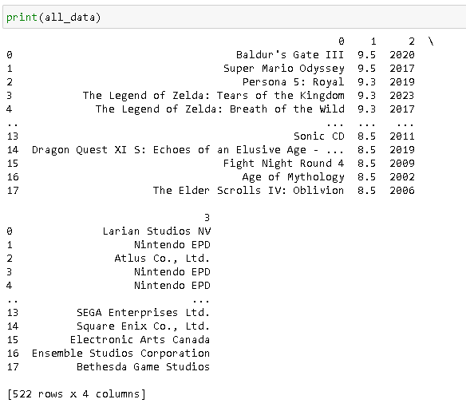

#### 7. The data contained in the Data Frame all_data is saved in a file with a csv extension called "consolas.csv"

```python
all_data.to_csv('consolas.csv', index=False)
```

#### 8. This same process is carried out with the other pages that are as sources to have more than one database that can help to make the prediction tool.

The results are the csv files: 
  
- 'juegos_mas_vendidos.csv'
- 'consolas.csv'
- 'consolas2.csv'
- 'moby_score.csv'
- 'vgsales.csv'
- 'video_games.csv
    
these files contain different information that will be carried out by the **Data Clean** process to eliminate, normalize and later save the data with the necessary variables for the exploratory analysis of the data.

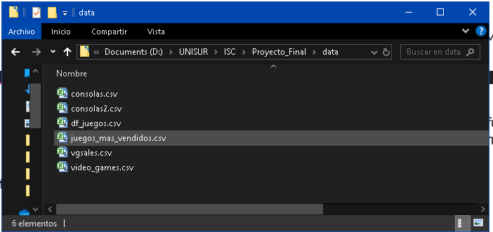

## 4. Data Clean
### 4.1 Description of the data

The data sets are in CSV format are:
- consolas.csv
- consolas2.csv
- juegos_mas_vendidos.csv
- vgsales.csv
- video_games.csv

The information contained in the CSV files is as follows:

**consolas.csv and consolas2.csv** : Contains information on video game platforms, games developed, and reviews.

-Attributes:
    - Platform: This attribute is of type string and describes the name of the game console for which the games were developed.
    - Games_x: This attribute is of integer type and represents the number of games that have been developed for the specific console represented in the "Platform" column.
    - Player Reviews: This attribute is of integer type and shows the number of comments or criticisms made by players about the console.
    - Critic Reviews: This attribute is of integer type and shows the number of reviews made by professional critics about the console.
    - Companies: This attribute is also a combination of text string and integer and shows the number of game development companies that have developed titles for the console.
    - Years: This attribute is a string of text with integer data that indicates the range of years during which the console has been on the market. For example, a value of "2001 - 2020" would indicate that the console was released in 2001 and is still in use until 2020.

**juegos_mas_vendidos.csv, vgsales.csv and video_games.csv**: Contains information on the best-selling games by platform, genre, etc., and statistics on the average time the player spends playing.

-Attributes: 
    - 'Title': string type The name of the video game.
    - 'Development company': string type The company or studio that developed the video game.
    - 'Release Date': type int The date on which the video game was officially released to the market.
    - 'Genre': string type The type or category of game to which the video game belongs (e.g. action, adventure, strategy, etc.).
    - 'Platform': string type The system or device on which the game was launched and can be played (e.g. PlayStation, Xbox, PC, etc.).
    - 'Multiplatform': string type An indicator of whether the video game is available on more than one platform.
    - 'Portable': bool type An indicator of whether the video game is available on portable platforms (e.g. Nintendo Switch, PSP, etc.).
    - 'Online': bool type An indicator of whether the video game has online gaming functionality.
    - 'Max Players': bool type The maximum number of players who can play the video game simultaneously.
    - 'Rating': type int The age rating or age recommendation for the video game (e.g. E for everyone, T for teenagers, M for mature, etc.).
    - 'Ranking': type int The place that the video game occupies in an ordered list, usually in terms of popularity or sales.
    - 'Review Score': float type The average rating or score that video game critics have given to the video game.
    - 'Sequel': bool type An indicator of whether the game is a sequel to a previous game.
    - 'Licensed': bool type An indicator of whether the video game is based on an existing license (e.g. a movie, TV series, comic book, etc.).
    - 'NA Sales': float type The number of copies of the game that have been sold in North America.
    - 'EU sales': float type The number of copies of the video game that have been sold in Europe.
    - 'JP Sales': float type The number of copies of the game that have been sold in Japan.
    - 'Other Sales': float type The number of copies of the video game that have been sold in other regions of the world.
    - 'Global Sales': float type The total number of copies of the game that have been sold worldwide.
    - 'Estimated Sales': float type An estimate of the total number of copies of the game that will be sold in the future, based on current sales trends.
    - 'Length.All PlayStyles.Average': float type Represents the average game duration taking into account all play styles.
    - 'Length.All PlayStyles.Leisure': float type Displays the duration of play for those players who enjoy the game in a more relaxed or casual way, covering all styles of play.
    - 'Length.All PlayStyles.Median': float type This is the median of the game duration, taking into account all play styles.
    - 'Length.All PlayStyles.Polled': float type Number of observations or samples used to calculate the average duration of all playstyles.
    - 'Length.All PlayStyles.Rushed': float type Reflects the duration of play for those players who advance more quickly, considering all styles of play.
    - 'Length.Completionists.Average': float type It is the average game duration for those completist players, who strive to reach 100% of the game.
    - 'Length.Completionists.Leisure': float type Displays the duration of the game for completionist players who play more relaxed or casually.
    - 'Length.Completionists.Median': float type This is the median of the game duration for completionist players.
    - 'Length.Completionists.Polled': float type Number of observations or samples used to calculate the average duration of completist players.
    - 'Length.Completionists.Rushed': float type Represents the duration of play for completist players who progress through the game in a more hurried manner.
    - 'Length.Main + Extras.Average': float type Shows the average game duration when playing the main story in addition to the bonus content.
    - 'Length.Main + Extras.Leisure': float type Game duration for those players who enjoy the main story and extra content in a more relaxed or casual way.
    - 'Length.Main + Extras.Medium': float type This is the median of the duration of the game, considering the story - - 'Length.Main + Extras.Polled': float type The number of observations or samples used to calculate the average duration of the main game plus the extra contents.
    - 'Length.Main + Extras.Rushed': float type Reflects the duration of the game for those players who advance more quickly through the main story and bonus content.
    - 'Length.Main Story.Average': float type Displays the average duration of the game's main story.
    - 'Length.Main Story.Leisure': float type Represents the duration of the main story of the game for those players who enjoy it in a more relaxed or casual way.
    - 'Length.Main Story.Median': float type This is the median length of the main story of the game.
    - 'Length.Main Story.Polled': float type Number of observations or samples used to calculate the average duration of the main story.
    - 'Length.Main Story.Rushed': float type Indicates the duration of the main story of the game for those players who advance it more quickly.

Diagram
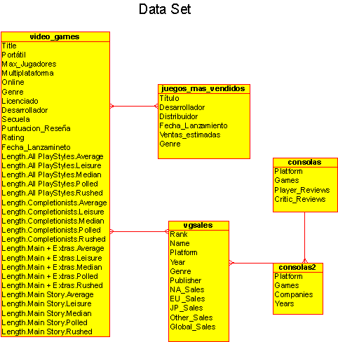

---

### 4.2 Data Upload

1. Module Installation


```python
# Module Installation
!pip install pandas
!pip install matplotlib
!pip install networkx
!pip install -U scikit-learn
!pip install sqlalchemy
```

2. Import modules

```python
# Import modules
Import pandas as PD
import numpy as np
import matplotlib.pyplot as plt
from sklearn.model_selection import train_test_split
from sklearn.preprocessing import StandardScaler
from sklearn.linear_model import LinearRegression
from sklearn.linear_model import LogisticRegression
from sklearn.metrics import confusion_matrix
Import seaborn as SNS
from sklearn.metrics import accuracy_score
from sklearn.ensemble import RandomForestClassifier
from sklearn.preprocessing import OneHotEncoder
from sklearn.metrics import classification_report, confusion_matrix
from sklearn.compose import ColumnTransformer
```

3. Read CSV files

```python
# Import modules
# Read CSV files
df_juegos_top = pd.read_csv('data/juegos_mas_vendidos.csv', encoding='utf-8')
df_consolas = pd.read_csv('data/consolas.csv', encoding='utf-8')
df_consolas2 = pd.read_csv('data/consolas2.csv', encoding='utf-8')
df_vgsales = pd.read_csv('data/vgsales.csv', encoding='utf-8')
df_video_games = pd.read_csv('data/video_games.csv', encoding='utf-8')
```

### 4.3 Preprocessing the data

#### 4.3.1 Merging data frames

Two DataFrames (df_consolas and df_consolas2) are going to be merged, the attributes in common are "Platform" which represents the name of the Platform on which the Video Game runs.

```python
# Merge Console DataFrames
df_consolas = pd.merge(df_consolas, df_consolas2, on='Platform', how='outer')
df_consolas.head()
```

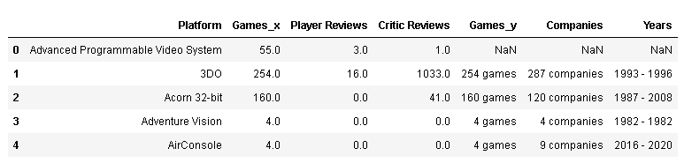


Three DataFrames (df_juegos, df_vgsales, df_video_games) are going to be merged, the common attributes are "Title" in df_juegos, "Name" in df_vgsales and "Title" in df_video_games which represents the name of the video game.

```python
# First, we renamed the columns to be the same across all DataFrames
df_juegos_top.rename(columns={'Title': 'Title'}, inplace=True)
df_vgsales.rename(columns={'Name': 'Title'}, inplace=True)
# You merge the DataFrames using the 'Title' column as a common attribute
df_juegos = df_juegos_top.merge(df_vgsales, on='Title', how='outer') # this merges df_juegos_top and df_vgsales
df_juegos = df_juegos.merge(df_video_games, on='Title', how='outer') # this adds df_video_games to the merged DataFrame

# Displays the resulting DataFrame
df_juegos.head()
```
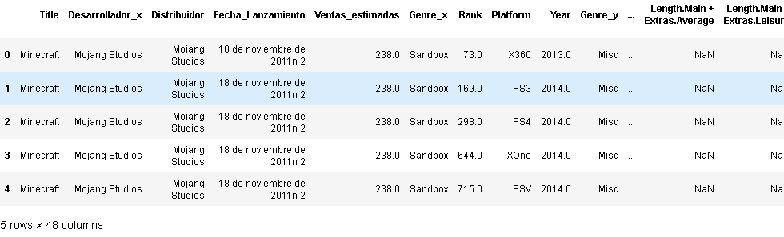

#### 4.3.2 Removing Irrelevant Variables

The DataFrame df_consolas, the 'Games_y' attribute will be removed as it is repeated with the 'Games_x' attribute, and the resulting attributes will be renamed:
- 'Platform': 'Platform',
- 'Companies': 'Company',
- 'Games_x': 'Juegos_Desarrollados',
- 'Years': 'Anios',
- 'Player Reviews': 'Resenas_Jugador',
- 'Critic Reviews': 'Cantidad_Criticas'  

All null values (NaN) in the DataFrame will be replaced according to the data type, such as:
- 'Platform' with 'Unknown'.
- 'Company' with 'Unknown'.
- 'Juegos_Desarrollados with 0.
- 'Anios' with 0.
- 'Resenas_Jugador' with 0.
- 'Cantidad_Criticas' with 0.

```python
# Removes the original 'Games_x' and 'Games_y' columns
df_consolas = df_consolas.drop(['Games_y'], axis=1)

# Extract the numbers from the text strings in the 'Companies' column and convert these numbers to integers
df_consolas['Companies'] = df_consolas['Companies'].str.extract('(\d+)').astype(float)

# Replaces all null (NaN) values in the DataFrame with 0
df_consolas = df_consolas.fillna(0)

df_consolas = df_consolas.rename(columns={
    'Platform': 'Platform',
    'Companies': 'Company',
    'Games_x': 'Juegos_Desarrollados',
    'Years': 'Anios',
    'Player Reviews': 'Resenas_Jugador',
    'Critic Reviews': 'Cantidad_Criticas'   
})

# Rearrange attributes according to the desired order, you can use the reindex() method
df_consolas = df_consolas.reindex(columns=['Platform', 'Company', 'Juegos_Desarrollados', 'Years', 'Resenas_Jugador', 'Cantidad_Criticas'])

df_consolas['Platform'].fillna('No information', inplace=True)
df_consolas['Company'].fillna('No Information', inplace=True)
df_consolas['Juegos_Desarrollados'].fillna(0, inplace=True)
df_consolas['Anios'].fillna(0, inplace=True)
df_consolas['Resenas_Jugador'].fillna(0, inplace=True)
df_consolas['Cantidad_Criticas'].fillna(0, inplace=True)

df_consolas.head()
```

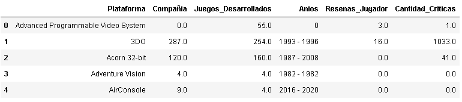

From the DataFrame df_juegos a more extensive processing of the data is carried out:

- The null values in column 'Genre_x' will be replaced with the corresponding values in column 'Genre_y'.

- The 'Genre_y' column is going to be removed from the DataFrame, this is done because the null values in 'Genre_x' have already been filled with the corresponding values.

- The columns: 'Fecha_Lanzamiento', 'Unnamed: 11', 'Fecha_Lanzamineto', 'Desarrollador_y', 'Genre', 'Desarrollador_x' and 'Distributor' are going to be removed.

- The columns in the DataFrame are to be renamed and a dictionary is provided in which the new name of each column is specified.

- The columns are rearranged for better understanding.

- A list called 'columns' is defined that contains the names of the columns to be modified, and each column in the list is iterated over to replace any null values they have.

- For string attributes, empty spaces will be replaced with 'Unknown'.
  
- A list called 'valores_incorrectos' ('2007', '2009', '2010', '2011', '2012', '2013', '2014', '2015') is defined, which contains the values to be replaced in the Gender attribute with 'Unknown'.

- For int or float attributes, empty spaces will be replaced with 0.
- For bool-type attributes, empty spaces are going to be replaced with 'False'.

```python
# the data in Genre_x and replace the NaN values with the corresponding values of Genre_y
df_juegos['Genre_x'] = df_juegos['Genre_x'].fillna(df_juegos['Genre_y'])
df_juegos = df_juegos.drop(columns='Genre_y')
df_juegos.head()
```

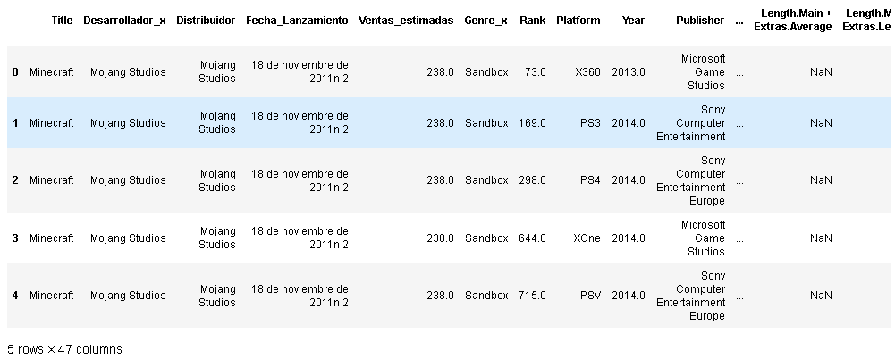

Attributes that are not used in the analysis are going to be removed

```python
# Attributes that are not used in the analysis are going to be removed
df_juegos = df_juegos.drop(['Fecha_Lanzamiento', 'Unnamed: 11', 'Fecha_Lanzamineto', 'Desarrollador_y','Genre', 'Desarrollador_x', 'Distributor' ], axis=1)
```

The resulting attributes are renamed

```python
# The resulting attributes are renamed
df_juegos = df_juegos.rename(columns={
    'Title': 'Title',
    'Genre_x': 'Gender',
    'Rank': 'Ranking',
    'Platform': 'Platform',
    'Year': 'Fecha_Lanzamiento',
    'Publisher': 'Compañia_Desarrollo',
    'NA_Sales': 'Ventas_NA',
    'EU_Sales': 'Ventas_EU',
    'JP_Sales': 'Ventas_JP',
    'Other_Sales': 'Ventas_Otros',
    'Global_Sales': 'Ventas_Globales'
})
```

Rearranging attributes for better understanding

```python
# Rearrangement of attributes for better understanding
df_juegos = df_juegos[[
    'Title', 
    'Compañia_Desarrollo', 
    'Fecha_Lanzamiento', 
    'Gender',    
    'Platform',
    'Multiplatform',
    'Portable', 
    'Online', 
    'Max_Jugadores',
    'Rating',
    'Ranking',
    'Puntuacion_Reseña',
    'Sequel',
    'Licenciado',
    'Ventas_NA',
    'Ventas_EU',
    'Ventas_JP',
    'Ventas_Otros',
    'Ventas_Globales',
    'Ventas_estimadas',
    'Length.All PlayStyles.Average',
    'Length.All PlayStyles.Leisure',
    'Length.All PlayStyles.Median',
    'Length.All PlayStyles.Polled',
    'Length.All PlayStyles.Rushed',
    'Length.Completionists.Average',
    'Length.Completionists.Leisure',
    'Length.Completionists.Median',
    'Length.Completionists.Polled',
    'Length.Completionists.Rushed',
    'Length.Main + Extras.Average',
    'Length.Main + Extras.Leisure',
    'Length.Main + Extras.Median',
    'Length.Main + Extras.Polled',
    'Length.Main + Extras.Rushed',
    'Length.Main Story.Average',
    'Length.Main Story.Leisure',
    'Length.Main Story.Median',
    'Length.Main Story.Polled',
    'Length.Main Story.Rushed'
]]
```

The columns attribute is created with the string attributes and the empty spaces are to be replaced with 'Unknown'

```python
# The columns attribute is created with the string attributes
# Empty spaces will be replaced with 'Unknown'
columns = ['Title','Compañia_Desarrollo','Genre','Platform','Rating']

for column in columns:
    df_juegos[column] = df_juegos[column].fillna('Unknown')
    df_juegos[column] = df_juegos[column].astype(str)
```

The 'Title' column in df_juegos will only contain the text before the colon for each game.

```python
# this code, the 'Title' column of df_juegos will only contain the text before the colon for each game.
df_juegos['Title'] = df_juegos['Title'].apply(lambda x: x.split(':')[0])
```

Replace white spaces with underscores in the 'Title' column

```python
# Replace blank spaces with underscores in the 'Title' column
df_juegos['Title'] = df_juegos['Title'].str.replace(' ', '_')
```

Define the values to be replaced in a list by the values in the 'Gender' column

```python
# Define the values to replace in a list
valores_incorrectos = ['2007', '2009', '2010', '2011', '2012', '2013', '2014', '2015']
# Replace the values in the 'Gender' column
df_juegos['Gender'] = df_juegos['Gender'].replace(valores_incorrectos, 'Unknown')
```

 The columns attribute is created with the attributes of type int or float and the empty spaces are replaced with '0'.

```python
# The columns attribute is created with the attributes of type int or float
# Empty spaces will be replaced with '0'
columns = ['Fecha_Lanzamiento','Max_Jugadores','Ranking','Puntuacion_Reseña','Ventas_NA','Ventas_EU',
          'Ventas_JP','Ventas_Otros','Ventas_Globales','Ventas_estimadas']

for column in columns:
    df_juegos[column] = df_juegos[column].fillna(0)
```

The columns attribute is created with the attributes of type bool and the empty spaces are to be replaced with 'False'.

```python
# The columns attribute is created with bool attributes
# Empty spaces will be replaced with 'False'
columns = ['Cross-platform', 'Portable', 'Online', 'Sequel', 'Licensed']

for column in columns:
    df_juegos[column] = df_juegos[column].fillna(False)
```

The columns attribute is created with the attributes of type float and the empty spaces are to be replaced with 'Unknown'.

```python
# The columns attribute is created with the attributes of type float
# Empty spaces will be replaced with 'Unknown'
columns = ['Length.All PlayStyles.Average','Length.All PlayStyles.Leisure','Length.All PlayStyles.Median',
            'Length.All PlayStyles.Polled','Length.All PlayStyles.Rushed','Length.Completionists.Average',
            'Length.Completionists.Leisure','Length.Completionists.Median','Length.Completionists.Polled',
            'Length.Completionists.Rushed','Length.Main + Extras.Average','Length.Main + Extras.Leisure',
            'Length.Main + Extras.Medium','Length.Main + Extras.Polled','Length.Main + Extras.Rushed',
            'Length.Main Story.Average','Length.Main Story.Leisure','Length.Main Story.Median',
            'Length.Main Story.Polled','Length.Main Story.Rushed']

for column in columns:
    df_juegos[column] = df_juegos[column].fillna(0)
```

Unnecessary columns are removed

```python
# List of columns to delete
columnas_a_eliminar = ['Length.All PlayStyles.Average','Length.All PlayStyles.Leisure','Length.All PlayStyles.Median','Length.All PlayStyles.Polled','Length.All PlayStyles.Rushed','Length.Completionists.Average','Length.Completionists.Leisure','Length.Completionists.Median','Length.Completionists.Polled','Length.Completionists.Rushed','Length.Main + Extras.Average','Length.Main + Extras.Leisure','Length.Main + Extras.Medium','Length.Main + Extras.Polled',' Length.Main + Extras.Rushed','Length.Main Story.Average','Length.Main Story.Leisure','Length.Main Story.Median','Length.Main Story.Polled','Length.Main Story.Rushed']

# Delete columns from the DataFrame
df_juegos = df_juegos.drop(columnas_a_eliminar, axis=1)

df_juegos.head()
```

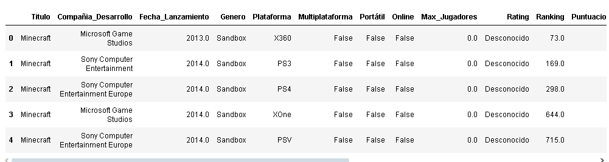

### 4.4 Definition of the Target Variable(s).

**The objective is to classify the 'Game Genre' and the 'Platform'**, either separately or together, to obtain the information of what type of Genre and Platform the Video Game can be developed; therefore, the correlation, classification and prediction of the Genre and Game Platform will be given **by the analysis of Successful Video Games**.

The **objective variable** will be to determine what type of game genre and platform will be useful for the creation of a new successful video game. In this context, **the success of a Video Game** is given **by the number of Copies Sold of the Video Game that is defined in the 'Global Sales' attribute**, so the **Variables** to be used to achieve the **Objective** of the project can include:

- **Game genre:** This variable represents the category or type of game to which it belongs, such as action, adventure, strategy, sports, etc.

- **Platform:** This variable indicates the system or device on which the game will be launched and played, such as PlayStation, Xbox, PC, Nintendo Switch, etc.

- Global Sales: This variable represents the total sales of the game worldwide. It will be **used** as a **measure of success** to determine **whether a game is successful or not**.

- Other variables: Other variables relevant to the analysis can also be considered, such as game rating, review scores, development company, release date, etc., depending on the availability of data and relevance to the specific goal.

### 4.5 Data Frame Storage in Relational Database
The process for storing data in a MySQL relational database having a data frame called df_juegos is to create a database that defines the tables, columns, data types of the variables that were obtained from the Data Clean process.

- A database is generated from the command terminal:

```SQL
CREATE DATABASE games;
```

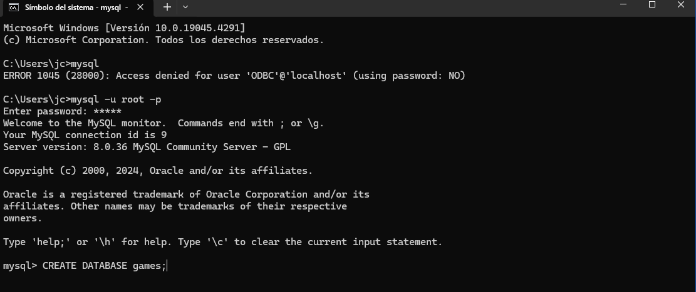

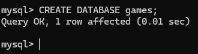

- From jupyter notebook the code is set to convert the df_juegos data frame into a table in the Games database. This will be done through a connection to the database server and using the sqlalchemy module and pymysql.

```python
!pip install pymysql
```

- SQLAlchemy is a library that facilitates interaction with relational databases and the create_engine function is used to create a SQLAlchemy engine object, which allows communication with the Games database. 

```python
from sqlalchemy import create_engine
```

- From the jupyter notebook application, a connection to the MySQL database is established. Access data (username and password) and MySQL server location (host and port) are provided.

- A table called video games is declared where the variables of the df_juegos data frame will be stored.

```python
# Configure the connection to the MySQL database
user = 'root'
password='mysql'
host = 'localhost'
Port = '3306'
base_de_datos = 'Games'
Engine = create_engine(f'mysql+pymysql://{user}:{password}@{host}:{port}/{base_de_datos}')

# Table Name
nombre_de_tabla = 'video games' # Rename the table as needed

# Create a table in MySQL from the DataFrame df_juegos
df_juegos.to_sql(nombre_de_tabla, con=motor, index=False, if_exists='replace')

print(f"DataFrame df_juegos successfully converted to table '{nombre_de_tabla}' in MySQL.")
```

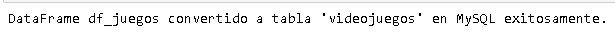

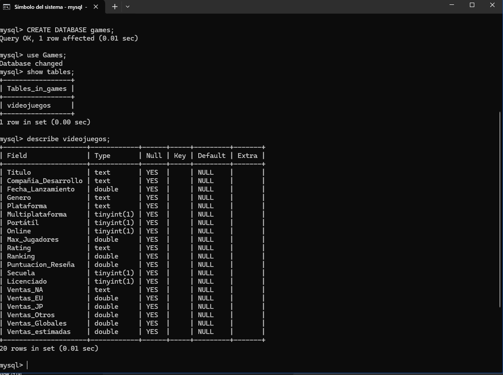

---

### 5. Data Modeling

---
#### 5.1 Data Modeling Process

Data modeling refers to the process of building algorithms (Machine Learning, Data Scinece, Big Data, among others), which can make predictions or estimates about future outcomes. In the context of the Project Objective, the data modeling to be developed is to predict the success or acceptance of a certain genre of game on a specific platform.

To apply predictive data modeling to this hypothesis, the following steps are performed:

- Data collection: Obtain a set of historical data that contains relevant information about games similar to the video game you want to develop. This data should include game features, such as genre, platform, sales, reviews, etc.
- Data preparation: Cleaning and preprocessing data, removing outliers, missing data, and performing necessary transformations.
- Selection of variables: Identify the variables or characteristics of the game that may influence its success or acceptance. This can include genre, platform, game-specific features, player demographics, etc.
- Model construction: Select the appropriate machine learning algorithm for the type of problem and available data. Examples could be logistic regression, decision trees, random forests, or neural networks.
- Model training: Use historical data to train the model, adjusting the algorithm parameters and optimizing its performance.
- Model validation: Evaluate model performance using techniques such as cross-validation or splitting data into training and test sets. Measure performance metrics such as accuracy, recall, F1 score, etc.
- Prediction and decision-making: Use the trained model to make predictions about the success or acceptance of a certain genre of game on a specific platform. These predictions can help in making decisions about the type of genre and platform to develop for the video game.

##### 1 Data collection

It is the data collected in csv format and having the data frame df_juegos and that was stored in a relational database in mysql called Games.

##### 2 Data Preparation

The resulting Data Frames are df_juegos since it was concluded that it will be used because it contains the information closest to the objective of the project.

##### 3 Selecting Variables

The variables to use and create the model are:
- 'Gender'.
- 'Platform'.
- 'Ventas_Globales'.

And its positive correlation with:
- 'Ranking'.
- 'Puntuacion_Reseña'.

##### 4 Building the Model

Based on the analysis of the results of the DataClean, the decision was made to create several "Data Models", for the reason of having a higher percentage of success than the Project Objective. The models to be created are Supervised Models, because they will use a set of labeled data, where the 'Ventas_Globales' of the video games (target variable) are known.

The models to be implemented:

- Classification Model: to predict the genre category of a video game with the input variables that will use the Random Forest classification algorithm.

- Linear regression, which will be used to train the model and adjust the regression coefficients. The selection of this algorithm is because it can find the best straight line that fits the data to predict the target variable. The linear regression model will predict global video game sales based on the variables used ('Genre', 'Platform' and 'Development Company'). These variables have characteristics to predict the global sales of video games and find possible relationships or patterns between them and global sales.

---

###### 5.6 Classification Model

The model is defined in the following steps:

- Predict the 'Gender' category.
- Implement the Random Forest algorithm: it is a powerful and versatile algorithm that can handle both categorical and numerical variables.
- The algorithm will find a decision boundary that separates the different classes in the space of the input variables.
- The input variables are 'Platform', 'Ranking', 'Puntuacion_Reseña' and 'Ventas_Globales'.
- The 'Platform' variable is categorical, so it is going to be encoded using the process called one-hot coding. 
- Divide the data into training and test sets.
- Predict labels for test data.
- Calculate the accuracy of the model.
- Display the Sorting Report.


```python
# Input and output variables
X = df_juegos[['Platform', 'Ranking', 'Puntuacion_Reseña', 'Ventas_Globales']]
y = df_juegos['Gender']

# One-hot encoding for the categorical variable 'Platform'
column_transformer = ColumnTransformer(
    [('Plataforma_category', OneHotEncoder(dtype='int'),['Platform'])],
    remainder='passthrough'
)

X = column_transformer.fit_transform(X)

# Split data into training and test sets
X_train, X_test, y_train, y_test = train_test_split(X, y, test_size=0.2, random_state=42)

# Create and train the model
model = RandomForestClassifier(n_estimators=100, random_state=42)
model.fit(X_train, y_train)

# Predict labels for test data
y_pred = model.predict(X_test)

# Calculate model accuracy
print("Accuracy:", accuracy_score(y_test, y_pred))

# Show the Confusion Matrix
print("Confusion Matrix:")
print(confusion_matrix(y_test, y_pred))

# Show Ranking Report
print("Classification Report:")
print(classification_report(y_test, y_pred))
```

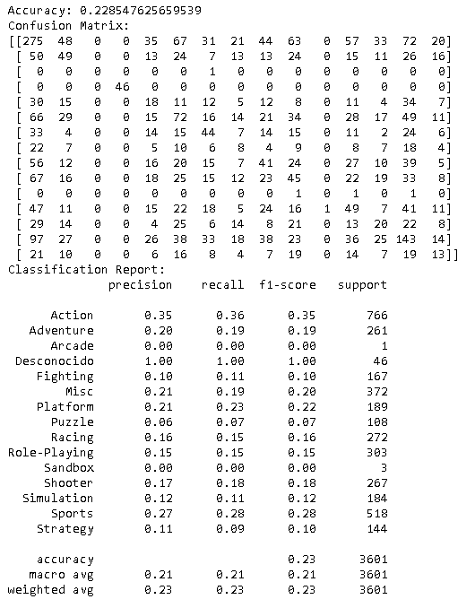


```python
# Classes for the chart
genres = ['Action', 'Adventure', 'Arcade', 'Unknown', 'Fighting', 'Misc', 'Platform', 
               'Puzzle', 'Racing', 'Role-Playing', 'Sandbox', 'Shooter', 'Simulation', 'Sports', 'Strategy']

# We calculate the confusion matrix
cm = confusion_matrix(y_test, y_pred)

# We turn the confusion matrix into a panda dataframe
cm_df = pd. DataFrame(cm, index=genres, columns=genres)

# We created the chart with Seaborn
plt.figure(figsize=(10, 8))
sns.heatmap(cm_df, annot=True, cmap='YlGnBu', fmt='g')
plt.title('Confusion Matrix for Video Game Genre Classifier \nPrecision:{0:.3f}'.format(accuracy_score(y_test, y_pred)))
plt.ylabel('True Value')
plt.xlabel('Predicted Value')
plt.show()
```

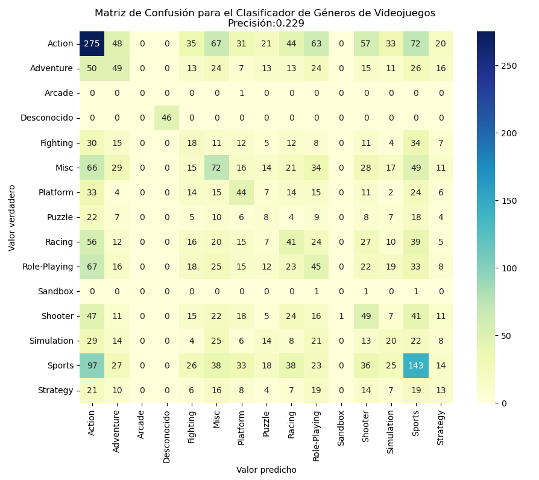

---

###### 5.2 Results of the Classification Model

The results based on the ranking report:


- The accuracy of the model is approximately 0.23 or 23%, which means that the model correctly predicts the genre of the game in 23% of the cases in the test set. Generally speaking, this is not very good.

- The confusion matrix shows how many times each class was correctly or incorrectly predicted. For example, the first row corresponds to the "Action" class. Out of 766 live-action games, the model correctly predicted 275 of them. However, he also incorrectly predicted 48 as "Adventure", 35 as "Fighting", 67 as "Misc", etc.


The classification report provides more details about the performance of the model for each class according to the metrics:


- Accuracy (Accuracy): It is the proportion of positive predictions that were correct, when the model predicts "Action", it is correct 35% of the time.


- Recall: It is the proportion of real positive cases that were correctly detected, the model detects 36% of real action games.


- F1-score: It is a metric that combines precision and recall in a single figure. It's useful when you want to compare two or more models, especially if you don't have a specific preference between accuracy and recall.

- Support: The number of occurrences of each class in the test suite.


These results suggest that the model has trouble predicting the genre of video games based on the input variables that have been used. It can be helpful to explore other variables, create new features, use another classification algorithm, or adjust the parameters of the current model to try to improve performance.

---

## 5.3 Regression Model

The model is defined in the following steps:

- Predict the 'Ventas_Globales' feature.
- Implement the linear regression algorithm: it is a statistical approach to model the relationship between a dependent variable (or target variable) and one or more independent variables (or characteristics).
- The algorithm will predict the 'Ventas_Globales' based on the 'Gender', 'Platform' and 'Compañia_Desarrollo' characteristics.
- The input variables are 'Gender', 'Platform' and 'Compañia_Desarrollo'.
- Define the characteristics and the objective: 'Gender', 'Platform' and 'Compañia_Desarrollo' are characteristics, and 'Ventas_Globales' is the objective.
- Convert categorical features to numerics, dummies will be used to convert these categorical features into numerical ones.
- Divide the data into training and test sets.
- Create and train the linear regression model.
- Predict global sales for the test set
- Prediction model results.


---


```python
# Define the characteristics (X) and the objective (y):
# Define the characteristics (X) and the objective (y)
X = df_juegos[['Genre', 'Platform', 'Compañia_Desarrollo']] # Here you can add more features if you want
Y = df_juegos['Ventas_Globales']

# Convert categorical features to numerical
X = pd.get_dummies(X)

# Split data into training and test sets
X_train, X_test, Y_train, Y_test = train_test_split(X, Y, test_size=0.2, random_state=42)

# Create and train the regression model
model = LinearRegression()
model.fit(X_train, Y_train)

# Predict sales for the test set
Y_pred = model.predict(X_test)
```

## 5.4 Training the Model

The model is trained using the 'Genre', 'Platform' and 'Compañia_Desarrollo' features to predict global video game sales. Categorical features are converted into numerical variables before the model is trained.

The model training process:

- The feature set (X) and objective (y) that will be used to train the model are defined. The characteristics (X) are obtained from the DataFrame df_juegos and the columns 'Gender', 'Platform' and 'Compañia_Desarrollo' are selected.

- Target (y) is obtained from DataFrame df_juegos and the 'Ventas_Globales' column is selected. Categorical features in X are converted to numerical variables using the one-hot coding technique using pd.get_dummies(X).

- Data is divided into training (X_train, y_train) and test (X_test, y_test) sets using the train_test_split() function. A test size of 20% is used and a random seed is established to ensure reproducibility of the results.

- A linear regression model object is created using LinearRegression(). The model is trained using the training data (X_train, y_train) using the fit() method.

Variables used:

- X: The feature set used to train the model. Includes the 'Genre', 'Platform', and 'Compañia_Desarrollo' columns of the df_juegos DataFrame.
- and: The objective of the model, which corresponds to the global sales of video games (column 'Ventas_Globales' in df_juegos).


```python
# Suppose we have a new game with the following attributes:
nuevo_juego = pd. DataFrame({
    'Genre': ['Action'], # Insert the genre of the new game here
    'Platform': ['PC'], # Insert the platform of the new game here
    'Compañia_Desarrollo': ['Capcom'], # Insert the new game development company here
})

# Convert categorical features to numerical
nuevo_juego = pd.get_dummies(nuevo_juego).reindex(columns = X_train.columns, fill_value=0)

# Use the model to predict sales of the new game
ventas_predichas = model.predict(nuevo_juego)

ventas_predichas = ventas_predichas[0]

print('Predicted global sales for the new game are:', ventas_predichas, 'of copies')
```

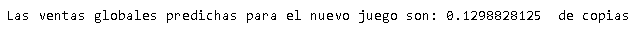

## 5.5 Model Validation

The model validation process:

- A new DataFrame called 'nuevo_juego' is created that represents a new game with attributes for which we want to predict global sales.
- The categorical attributes of the new game ('Genre', 'Platform', 'Compañia_Desarrollo') are converted to numerical variables using the one-hot encoding technique using pd.get_dummies(nuevo_juego).
- The DataFrame nuevo_juego is reindexed to ensure that all columns are the same as those used during model training. This is accomplished by reindex(columns=X_train.columns, fill_value=0), where X_train is the feature set used to train the model.
- The trained model is used to predict the overall sales of the new game using the predict(nuevo_juego method.
- The value of predicted global sales is stored in the ventas_predichas variable.
- The message "Predicted global sales for the new game are:" is printed on the screen, followed by the value of ventas_predichas[0], which represents the sales prediction for the new game.

The validation of the model is done in such a way that it will assign new values to the specific attributes and predict sales of the new game. This can allow you to get an estimate of the overall sales of the new game based on the trained model.

---

## 5.6 Regression Model Results

The prediction of the model using linear regression from the attributes 'Gender', 'Platform' and 'Compañia_Desarrollo' results in: 

**Predicted global sales for the new game are: 0.1502685546875 copies**

The trained model can make predictions about the success of a certain genre of game on a specific platform. These predictions can help in making decisions about the type of genre and platform to develop the video game.

---

## 5.7 Logistic Regression Model

The model is defined in the following steps:

- Predict the probability that a video game will be successful or not.
- Implement the Logistic Regression algorithm: it is an algorithm that adjusts the regression coefficients to find the best line of separation between classes.
- The algorithm will predict the probability of correctly classifying video games as successful or unsuccessful, it will use the variables 'Genre', 'Platform' and 'Development Company'.
- The variables the predictor variables 'Gender', 'Platform' and 'Development Company'.
- Define the characteristics 'Gender', 'Platform' and the objective 'Successful'.
- Adjust logistic regression coefficients to maximize the probability of correctly classifying video games as successful or unsuccessful.
- Calculate the average of overall sales and use it as a threshold to determine which games will be considered successful.
- Create a new column called 'Successful' that indicates if global sales exceed the threshold.
- Perform one-hot coding of the categorical columns 'Gender' and 'Platform' using scikit-learn's OneHotEncoder.
- Divide the data into training and test sets.
- Create the logistic regression classifier using LogisticRegression.
- Train the model using the training data.
- Predict whether a video game is successful or not.
- Evaluate the performance of the model in classifying games as successful or unsuccessful.


---

```python
df_juegos['Ventas_Globales'] = df_juegos['Ventas_Globales'] * 1000000
media_ventas_globales = df_juegos['Ventas_Globales'].mean()
print(f"Average Global Sales: {media_ventas_globales}")

threshold = media_ventas_globales

df_juegos['Successful'] = df_juegos['Ventas_Globales'] > threshold

# Assign the predictor variables (X) and the target variable (y)
X = df_juegos[['Genre', 'Platform']]
Y = df_juegos['Successful']

# One-Hot encoding of categorical columns
encoder = OneHotEncoder()
encoded_df = pd. DataFrame(encoder.fit_transform(X).toarray())

# Get categorical column categories
categories = encoder.categories_

# Create a list with the names of the new columns
new_columns = [f'{col}_{val}' for col, vals in zip(['Genre', 'Platform'], categories) for val in waltz]

# Assign the new names to the columns of the DataFrame
encoded_df.columns = [new_columns]

# Split data into training and test sets
X_train, X_test, Y_train, Y_test = train_test_split(encoded_df, Y, test_size=0.2, random_state=42)

# Create the logistic regression classifier
classifier = LogisticRegression()

# Train the model
classifier.fit(X_train, Y_train)

# Make predictions on test data
Y_pred = classifier.predict(X_test)

# Evaluate the model
print(classification_report(Y_test, Y_pred))
print(confusion_matrix(Y_test, Y_pred))
```

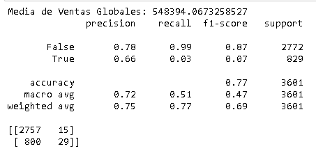

## 5.8 Training the Model

- Data is pre-processed. Multiply the 'Ventas_Globales' column by 1,000,000 to get the overall sales in more manageable units. 

- The average of global sales is calculated and used as a threshold to determine which games will be considered successful.

- A new column called 'Successful' is created indicating if global sales exceed the threshold.

- The predictor variables (X) and the target variable (Y) are assigned from the DataFrame 'df_juegos'. The predictor variables are 'Gender' and 'Platform', and the target variable is 'Successful'.

- One-hot coding of the categorical columns 'Gender' and 'Platform' is performed using the OneHotEncoder encoder from scikit-learn. This is necessary to convert categorical variables into numerical variables that the model can understand.

- Data is divided into training and test sets using the train_test_split function. In this case, 20% of the data is assigned to the test set and the remaining 80% to the training set.

- The logistic regression classifier is created using scikit-learn's LogisticRegression and the model is trained using the training data (X_train, Y_train).

- Once the model is trained, predictions are made on the test data using the classifier's predict method. Predictions are stored in the variable 'Y_pred'.

- The model is evaluated using the classification_report and confusion_matrix function to obtain evaluation metrics such as accuracy, recall, F1-score, and confusion matrix. These metrics allow you to evaluate the performance of the model in classifying games as successful or unsuccessful.

---

### 5.9 Model Validation

Model validation is performed using techniques of splitting the data into training and test sets, and subsequently evaluating the performance of the model in the test set.

In this case, we used the train_test_split method of the scikit-learn library to split the data into a training set (X_train, Y_train) and a test set (X_test, Y_test). The parameter test_size=0.2 indicates that 20% of the data has been assigned to the test set, while the remaining 80% has been used for training.

After splitting the data, a logistic regression classifier has been created using LogisticRegression from scikit-learn. This classifier has been trained using the training data (X_train, Y_train).

Once the model has been trained, predictions have been made on the test data using the classifier's predict method. These predictions have been stored in the variable Y_pred.

Finally, the model has been evaluated using the classification_report and confusion_matrix evaluation metrics. The classification_report provides detailed information about the accuracy, recall, and F1-score for each class, as well as the support (number of instances) of each class in the test suite. The confusion_matrix displays the confounding matrix, which provides information about the model's correct and incorrect predictions.


---


```python
# Get the Confusion Matrix
cm = confusion_matrix(Y_test, Y_pred)

# Create a figure
plt.figure(figsize=(6, 6))

# Create the Confusion Matrix Heatmap
sns.heatmap(cm, annot=True, fmt='d', cmap='Blues', cbar=False)

# Configure the names of the axes
plt.xlabel('Prediction')
plt.ylabel('Current')

# Setting the title
plt.title('Confusion Matrix')

# Show the figure
plt.show()
```

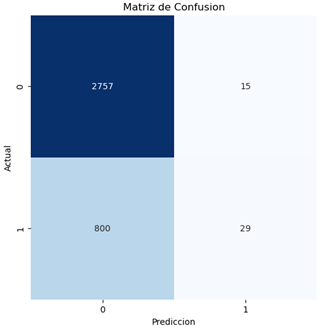

## 5.10 Results of the Logistic Regression Model

The results based on the ranking report:


- Accuracy: Accuracy is the proportion of positive predictions that were actually correct. In your case, the accuracy for the "False" class is 87%, which means that 87% of the predictions for unsuccessful games were correct. For the "True" class, the accuracy is 61%, indicating that 61% of the predictions of successful games were correct.

- Recall: Recall, also known as sensitivity or true positive rate, is the proportion of positive cases that were correctly identified by the model. In your case, the recall for the "False" class is 100%, which means that the model correctly identified all unsuccessful games. However, the recall for the "True" class is very low, at 5%, indicating that the model did not properly identify most successful games.

- F1-score: The F1-score is a measure that combines both accuracy and recall into a single metric. It is useful when there is an imbalance of classes. In your case, the F1-score for the "False" class is 93%, indicating a good balance between accuracy and recall. However, the F1-score for the "True" class is very low, at 9%, indicating poor performance in detecting successful games.

- Support: The "support" represents the number of samples of each class in the test data.

- Accuracy: The overall accuracy of the model in correctly predicting both classes is 87%. However, due to class imbalance, this metric can be misleading.

- Confusion matrix: The confusion matrix shows the distribution of predictions in each class. In your case, the model correctly predicted 3109 unsuccessful games and 22 successful games. However, there were also 456 successful games misclassified as unsuccessful and 14 unsuccessful games misclassified as successful.

These results suggest that the model seems to perform well in ranking unsuccessful games, but perform poorly in ranking successful games. This could indicate that there is a class imbalance in the data or that the model needs tweaking or improvement to properly detect successful games.


---

### 5.11 Prediction and Decision Making

The predictions of the different models:

- Results of the Classification Model: the model has problems predicting the genre of video games based on the input variables that have been used.


- Results of the Linear Regression Model: the model based on the attributes 'Genre', 'Platform' and 'Compañia_Desarrollo' results in "the predicted global sales for the new game are: 0.1502685546875 copies".


- Results of the Logistic Regression Model: the model does not have satisfactory results, it has difficulties in correctly identifying successful video games.

Therefore, decision-making is based on the **_Objetivo of proyecto_** and the result of the **_Modelos of datos_**, it is decided that the most appropriate model to use is the **Lineal_** Regression _Modelo**, which was designed to predict a continuous numerical value (global sales).

In this case, the linear regression model was the only one that produced a directly usable prediction, giving a value of the number of millions of copies when entering the attributes:

- 'Genre': Example of the value to be entered ('Action').
- 'Platform': Example of the value to be entered ('PC').
- 'Compañia_Desarrollo': Example of the value to be entered ('Capcom').


Logistic classification and regression models, on the other hand, are used to predict categories or classes, and in context, it was shown to have difficulty making accurate predictions in the genre of a video game or whether a video game will be successful or not.

However, given the low accuracy of the models, other features of the dataset can be explored or different models (regression trees, vector support or neural networks) can be tested. In addition, it may be useful to collect more data, or try to adjust the parameters of the models to improve the accuracy of the predictions.


---

#### 5.12 Save the Model
Having the linear regression model (trained and validated) the model is saved, for this the joblib library is used. With the code, the linear regression model is saved in a file called 'modelo_regresion_lineal.pkl'. And you can upload this file to a Webapp application to use in the prediction defined in the project objective.

```python
!pip install joblib
```


```python
import joblib

# Save the model to a file
joblib.dump(model, 'modelo_regresion_lineal.pkl')

# Later, you can upload the model from the
modelo_cargado = joblib.load('modelo_regresion_lineal.pkl')
```

### 5.11 Web Application Prediction

Now that you have the linear regression model file "model_regresion.pkl" pre-trained and saved in binary format using the scikit-learn library in Python. This file encapsulates the knowledge acquired by the model during the training process, which allows it to make accurate predictions (because there was a high percentage of training and validation) on new data.
The "model_regresion.pkl" file will be loaded into an application to make real-time predictions based on input data provided by the user or by other data sources. To determine the development success of a video game from the variables "Genre", "Platform" and "Development Company" based on the fact that the average total sales of global copies of the game must be greater than 548394 copies for the game to be successful. This ability to predict can be fundamental in a future sales prediction scenario of possible future video game developments.

#### 5.11.1 Development

The regression model was implemented in a web application using Flask and Python.
Configuring the development environment:
1.	Install Flask and the necessary dependencies for your application.

```python
!pip install Flask==2.3.2
!pip install pandas==1.3.0
!pip install pipscikit-learn==0.24.2
!pip install numpy==1.21.0
!pip install gunicorn==20.1.0
```
2.	Organize your Flask project in a logical folder structure.

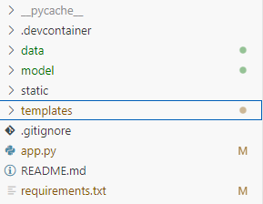

3.	Create a Flask application in a Python file, in app.py.
Import Flask and other necessary libraries.

```python
from flask import Flask, render_template, request
Import pandas as PD
Import pickle
Loads the trained regression model using joblib.load().
app = Flask(__name__)
# Load the model
model = pickle.load(open('model/model_regresion.pkl', 'rb'))
```
4.	Defines routes for the application, such as the root path ("/") and any other paths required to handle requests.

```python
# Load the dataframe
df_juegos = pd.read_csv('data/df_juegos.csv')
# Load the training model columns
with open('model/X_train.pkl', 'rb') as f:
    model_columns = pickle.load(f)
```

5.	In the request handling function, it makes the prediction using the loaded regression model and the data provided in the request.

```python
@app.route('/')
def home():
    genres = df_juegos['Genre'].unique().tolist()
    platforms = df_juegos['Platform'].unique().tolist()
    companies = df_juegos['Compañia_Desarrollo'].unique().tolist()
    
    return render_template('index.html', genres=genres, platforms=platforms, companies=companies)

```
6.	Returns the prediction result as an HTTP response.

```python
@app.route('/predict', methods=['POST'])
def predict():
    # Receive the form data
    genre = request.form['gender']
    platform = request.form['platform']
    company = request.form['company']
    
    # Create a dataframe with the received data
    nuevo_juego = pd. DataFrame({
        'Genre': [gender],
        'Platform': [platform],
        'Compañia_Desarrollo': [company]
    })

    # Convert categorical features to numerical
    nuevo_juego = pd.get_dummies(nuevo_juego)
    nuevo_juego = nuevo_juego.reindex(columns=model_columns, fill_value=0)

    # Make the prediction
    ventas_predichas = model.predict(nuevo_juego)
# Generate the message
    if ventas_predichas[0] >= 0.548394:
        message = "The prediction suggests that the game will be successful"
    else:
        message = "Some of the selected features do not meet the requirements for the game to be successful"

    return render_template('result.html', prediction=ventas_predichas[0], message=message)

if __name__ == '__main__':
    app.run(debug=True, port=5002)

```

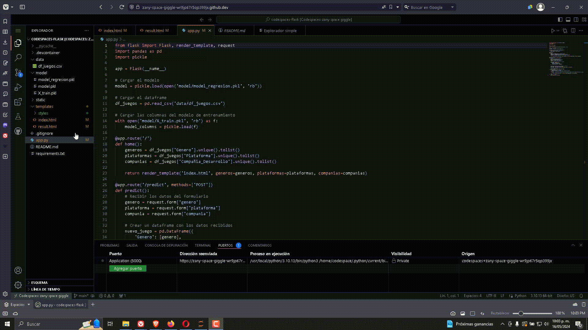

---

7.	Creating HTML Templates:
Create HTML templates for your app's UI by uploading index.html for capturing the "Genre", "Platform", and "Development Company" variables.


```HTML
<body>
    <div class="logo"></div>
    <h1>Enter your game details</h1>
    <form action="/predict" method="post">
        <label for="genus">Gender:</label>
        <select name="gender" id="gender">
            
                <option value="{{ genus }}">{{ genus }}</option>
            
        </select>
        <label for="platform">Platform:</label>
        <select name="platform" id="platform">
            
                <option value="{{ platform }}">{{ platform }}</option>
            
        </select>
        <label for="company">Development Company:</label>
        <select name="company" id="company">
            
                <option value="{{ company }}">{{ company }}</option>
            
        </select>
        <input type="submit" value="Predict Sales">
    </form>
</body>

```

Use HTML tags to collect user input, such as forms or text fields.
Render the prediction result in the HTML template using Flask's templating engine.

8.	UI Style and Design:
Use CSS to design and style your app's UI.


```CSS
<style>
body {
    font-family: Arial, sans-serif;
    background-color: #f6f8fa;
    margin: 0;
    padding: 0;
    Display: Flex;
    flex-direction: column;
    align-items: center;
}
h1 {
    Color: RGBA (248, 173, 59, 1.0);
    text-align: center;
    margin-bottom: 20px;
}
.logo {
    background-image: url('https://d2j6dbq0eux0bg.cloudfront.net/images/43093237/3601039288.png');
    background-size: contain;
    background-repeat: no-repeat;
    width: 200px; /* Adjust width as needed */
    height: 100px; /* Adjust height as needed */
    margin-bottom: 20px;
}
form {
    background-color: #fff;
    padding: 30px;
    border-radius: 10px;
    Box-Shadow: 0 4px 8px RGBA(0, 0, 0, 0.1);
    max-width: 500px;
    margin: 20px auto;
}
label {
    display: block;
    margin-bottom: 10px;
    Color: RGBA (248, 173, 59, 1.0); /* Text Color */
}
Select
input[type="submit"] {
    width: calc(100% - 22px);
    padding: 12px;
    margin-bottom: 20px;
    border: 1px solid #d1d5da;
    border-radius: 8px;
    box-sizing: border-box;
    Color: RGBA (248, 173, 59, 1.0); /* Text Color */
}
input[type="submit"] {
    background-color: rgba(248, 173, 59, 1.0); /* Button Background Color */
    Color: #fff;
    cursor: pointer;
    transition: background-color 0.3s ease;
}
input[type="submit"]:hover {
    background-color: rgba(218, 148, 0, 1.0); /* Color change on hover */
}
/* Add a shadow effect when sharpening fields */
input:focus,
select:focus {
    Box-Shadow: 0 0 8px rgba(3, 102, 214, 0.5);
    outline: none;
}
</style>
```


9.	Access your web application through a web browser by visiting the URL provided by Flask.

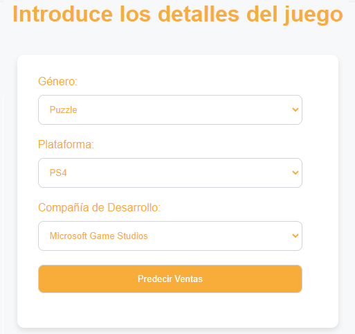

10.	Deployment:
Deploy your web application on a server so that it is publicly available through an html file called result.html.

```HTML
<body>
    <div class="logo"></div>
    <h2>The average total global sales for all platforms is: 548394</h2>
    <h1>{{ message }}</h1>    
    <h3>The result of the prediction is: {{ prediction*1000000}} </h3>   
    <a href="/">Return to homepage</to>
</body>

```
It is considered to use the github Code Spaces cloud hosting service for the deployment of the result.

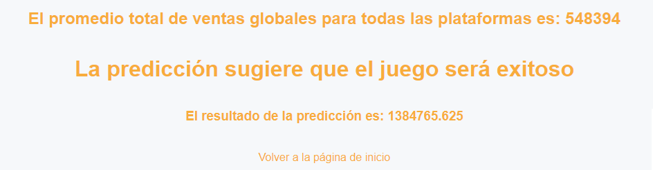


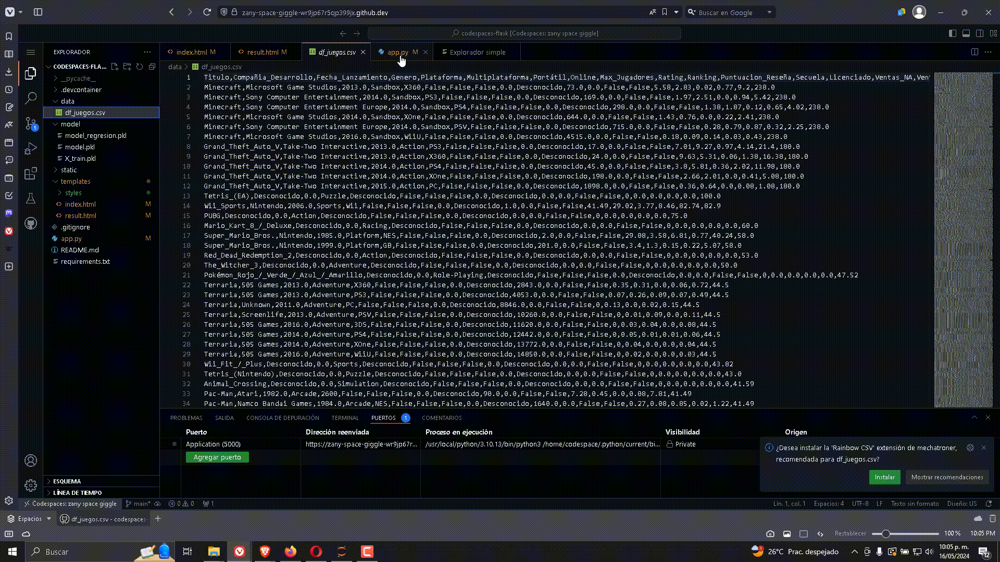

---

## 6 Exploratory Data Analysis (AED)

In the exploratory analysis, the DataFrames are analyzed with the information provided in the previous section, the purpose is to analyze and investigate the datasets, summarize their main characteristics, identify relationships, understand the distribution of the target variable(s) and variables to achieve the objective of the project.

It is defined as doing the following:

- #### Global Sales Analysis by year.
- #### Global Sales Correlation Analysis by Console and Genre.
- #### Analysis of Global Video Game Sales by Platform.
- #### Global Sales Analysis by Gender.
- #### Global Sales Analysis by Development Company.
---

## 6.1 Global Sales Analysis by year.

In this analysis, the distribution of video game sales globally over the years is examined using the attribute 'Fecha_Lanzamiento' which contains the information of the date on which the video game was released for sale and the attribute 'Ventas_Globales' which contains the information of the total global sales of the video game,  so the relationship of global sales with the year of launch is visualized in a line graph.
The goal is to identify patterns or trends in sales over time, such as peaks or declines in certain years. This can help to understand the evolution of the video game industry and make strategic decisions based on historical sales.

---


```python
# Global sales per year
df_juegos_validos = df_juegos[df_juegos['Fecha_Lanzamiento'] != 0]
ventas_por_año = df_juegos_validos.groupby('Fecha_Lanzamiento')['Ventas_Globales'].sum()

# Graph of global sales lines by year
plt.figure(figsize=(10,6))
ventas_por_año.plot(kind='line', linewidth=2, color='blue') # The line is now blue and thicker

# Get peak year and sales
max_year = ventas_por_año.idxmax()
max_ventas = ventas_por_año[max_year]

# Graph the maximum point
plt.scatter([max_year], [max_ventas], color='red') # Draws a red dot at the maximum value

plt.title('Global Sales by Year')
plt.xlabel('Year of Release')
plt.ylabel('Global Sales (in millions)')
plt.xlim([1980, 2017]) # This defines the range of the X-axis
plt.xticks(range(1980, 2018, 1), rotation=90) # This sets the ticks from 1980 to 2017, one at a time
plt.grid(True)
plt.show()
```

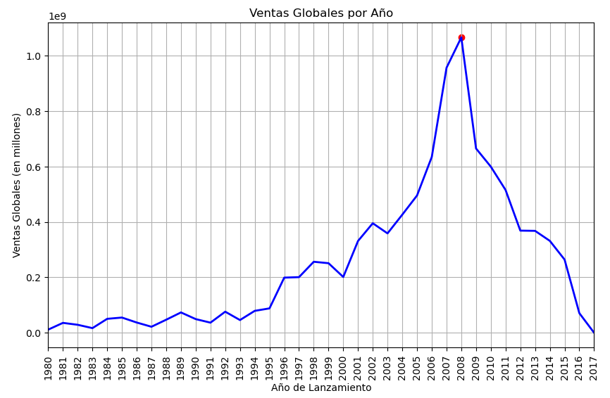

### 6.1.1 Relevant information:

- The average global sales average 500000 thousand copies in the span of 37 years.
- The highest peaks of global sales are between 2007 and 2008.
- The sales trend increased from the year 2000, but from 2015 sales decreased.

---

## 6.2 Global Sales Correlation Analysis by Console and Genre.

You can explore the correlations between the different attributes you have in the DataFrame df_juegos to help you better understand their relationships and select features for data modeling.

The correlation matrix is a table that shows the correlation coefficient (also known as Pearson's r) between pairs of variables in a dataset. Each cell in the table shows the correlation between two variables.

The characteristics of the correlation matrix are:

- Correlation coefficient, which is a statistical measure that describes the degree of relationship between two variables.
- The correlation coefficient can range from -1 to +1.
- A correlation of +1 indicates a strong positive correlation: this means that the two variables tend to increase together.
- A correlation of -1 indicates a strong negative correlation: this means that as one variable increases, the other decreases.
- A correlation of 0 indicates that there is no linear relationship between the variables.

---

```python
# Select only the numerical columns
numeric_df = df_juegos.select_dtypes(include=[np.number])

# Now we calculate the correlation matrix with only the numerical columns
correlation_matrix = numeric_df.corr()
# Assuming 'df' is your DataFrame and 'correlation_matrix' is the correlation matrix you have calculated
plt.figure(figsize=(15,10))
sns.heatmap(correlation_matrix, annot=True)
plt.title('Correlation matrix of DataFrame')
plt.xticks(rotation=90)
plt.yticks(rotation=0)
plt.show()
```

! [Result](img/27.png)

By visualizing the correlation matrix with the heatmap, you can get a view of how the variables in the DataFrame df_juegos dataset are correlated.

On the heat map:

- Colored cells represent correlations between variables.
- The color of each cell is determined by the correlation value and the color map being used.
- Strong correlations (close to 1 or -1) are indicated by more intense colors, while weak correlations (close to 0) are indicated by lighter colors.

**A strong positive correlation is visualized between the 'Ventas_Globales', 'Ranking' and the 'Puntuacion_Reseña', so it can be inferred that video games with higher review scores tend to have more overall sales. This suggests that the quality of a game (as measured by reviews) can influence its commercial success. However, correlation does not imply causation and more research is needed to understand the relationship between these variables.**

---

### 6.2.1 Relationship between Gender and Global Sales**

To deepen the correlation analysis, the relationships between three variables will be graphed: 'Platform', 'Ventas_Globales', and 'Gender'. The variable 'Platform' is displayed along the x-axis, the variable 'Ventas_
Global' is shown along the y-axis, and the variable 'Gender' is represented by the color of the dots.

Therefore, each dot on the graph represents a game, and its position on the y-axis indicates the platform on which the game was launched and the Global sales it had. The color of the dot indicates the genre of the game.

You can see at each point of the graph how sales in Globals vary by platform and genre.

---

```python
# Adjust the size of the figure
plt.figure(figsize=(20,8))

# Create a 2D scatterplot where the third variable ('Gender') is represented by the color of the dots
sns.scatterplot(data=df_juegos, x='Genre', y='Ventas_Globales', hue='Platform')

plt.title('Relationship between Gender and Global Sales')
plt.xlabel('Genre')
plt.ylabel('Global Sales (in millions)')

# Rotate x-axis labels to 45 degrees for better readability
plt.xticks(rotation=90, ha='right')  
plt.yticks(rotation=0)   
plt.grid(True)
plt.show()
```
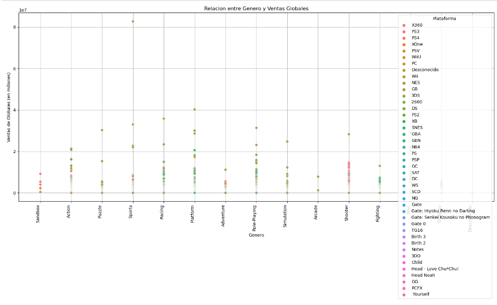

Dots of a specific color (video games of a certain genre) are concentrated in a certain area of the graph, suggesting that the genre tends to have more sales on certain platforms.

### 6.2.2 Relevant information:
- **The average global sales of each genre are below 10 million copies, therefore, it is suggested to make an analysis of the global sales averages by genre and/or platform.**
- The genres that sell the most are Action, Racing, Platform, Role Playing and Shooter.
- The platforms that sell the most by genre are:
  - Action (Nintendo, Play Station and Xbox).
  - Racing (Nintendo, Play Station and Xbox).
  - Action (Nintendo, Play Station and Xbox).
  - RPG (Nintendo, Play Station and Xbox).
  - Shooter (Play Station and Xbox).
  
  ---

## 6.3 Analysis of Global Video Game Sales by Platform.

As a result of the above correlation analysis, it can be seen that the relationship between the 'Ventas_Globales', 'Genre' and 'Platform' is below 1 million copies, therefore, an analysis of the average of 'Ventas_Globales will be carried out.

In this analysis, the distribution of video game sales is examined according to the platform on which they are played, using the 'Platform' attribute that contains the information of the platform on which the video game runs and the 'Ventas_Globales' attribute that contains the information of the total global sales of the video game, so the relationship can calculate the total sales by Platform and visualize this information in a line graph marking each peak in the 'Platform' attribute of the most popular or successful video games in terms of sales. This can be useful for understanding the console market and making decisions about the development and distribution of specific games for certain platforms.


---

**The average Global Sales for each Platform will be calculated and obtained.**

---

```python
# Calculate the average of 'Ventas_Globales' for each 'Platform'
media_ventas_por_plataforma = df_juegos.groupby('Platform')['Ventas_Globales'].mean()

# Calculate the average of 'Ventas_Globales' for each 'Genre'
media_ventas_por_genero = df_juegos.groupby('Gender')['Ventas_Globales'].mean()
```

---

Global sales by platform are plotted from highest to lowest.

---

```python
# Sort media_ventas_por_plataforma from highest to lowest average
media_ventas_por_plataforma_sorted = media_ventas_por_plataforma.sort_values(ascending=False)

# Create a bar chart for media_ventas_por_plataforma_sorted
media_ventas_por_plataforma_sorted.plot(kind='bar', figsize=(12, 6))
plt.title('Average Global Sales by Platform')
plt.ylabel('Average Global Sales')
plt.xlabel('Platform')
plt.xticks(rotation=90)
plt.grid(True)
plt.show()
```
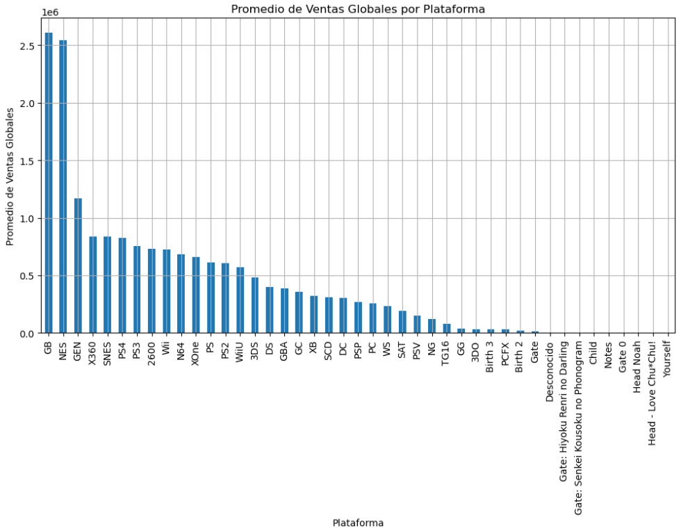

```python
# Calculate the total average global sales
promedio_total_ventas_globales = df_juegos['Ventas_Globales'].mean()*1000000

# Print the result
print(f"The average total global sales for all platforms is: {promedio_total_ventas_globales}")
```

**Total global sales average for all platforms is: 548394067325.8527**

---

### 6.3.1 Relevant information:
- The average global sales per platform are below 1 million copies.
- The average total global sales for all platforms is 548394 million copies.
- The platforms that sell the most are Nintendo, Play Station and Xbox.

---

## 6.4 Global Sales Analysis by Gender.
In this analysis, the distribution of video game sales at a global level is examined using the 'Genre' attribute that contains the information of the video game genre and the 'Ventas_Globales' attribute that contains the information of the total global sales of the video game, so the relationship can calculate the total sales by genre and visualize this information in a line graph marking each maximum point in the video game 'Genre' attribute more popular or successful in terms of sales. This can be useful for making decisions related to the development and marketing of new games, as well as for understanding players' interests and preferences.

```python
# Sort media_ventas_por_plataforma from highest to lowest average
media_ventas_por_genero_sorted = media_ventas_por_genero.sort_values(ascending=False)
# Create a bar chart for media_ventas_por_genero
media_ventas_por_genero_sorted.plot(kind='bar', figsize=(12, 6))
plt.title('Average Global Sales by Gender')
plt.ylabel('Average Global Sales')
plt.xlabel('Genre')
plt.xticks(rotation=90)
plt.grid(True)
plt.show()
```

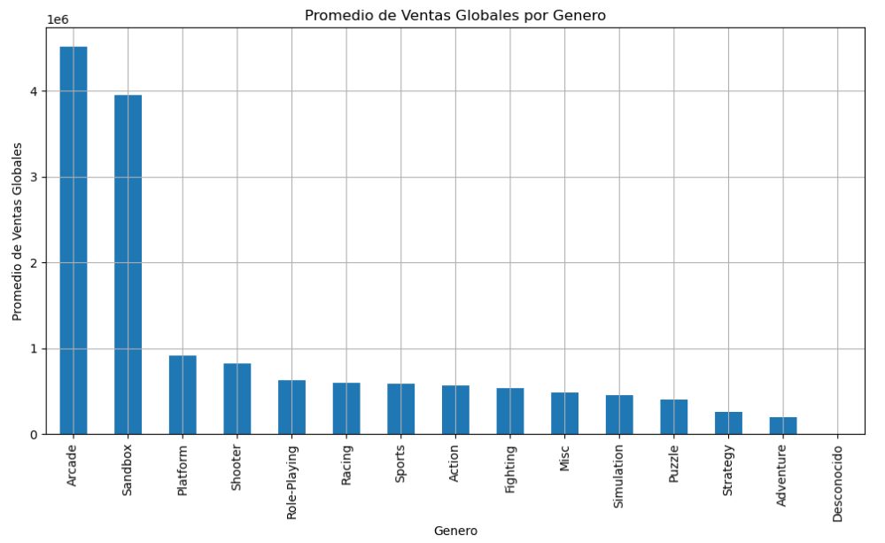

### 6.4.1 Relevant information:

- The average global sales by genre are below 1 million copies.
- The average total global sales for all Genres is 548394 million copies.
- The best-selling Genres are:
  -Arcade.
  -Sandbox.
  - Platform.
  -Shooter.
  -RPG.
  -Racing.
  - Sports.
  -Action.
  
  ---

  ## 6.5 Global Sales Analysis by Development Company.

In this analysis, the distribution of video game sales at a global level according to the game development company is examined, using the 'Compañia_Desarrollo' attribute that contains the information of the company that developed the video game and the 'Ventas_Globales' attribute that contains the information of the total global sales of the video game, so the relationship can calculate the total sales by company and visualize this information in a graph of linear.
The objective is to identify which development companies are most successful in terms of video game sales. This can be useful for evaluating the reputation and performance of development companies and making decisions about partnerships or acquisitions in the industry.

---

```python

# Global Sales by Development Company
ventas_por_compañia = df_juegos.groupby('Compañia_Desarrollo')['Ventas_Globales'].sum().sort_values(ascending=False).head(22)

plt.figure(figsize=(12,6))
plt.plot(ventas_por_compañia.index, ventas_por_compañia.values, marker='o', linestyle='-')
plt.title('Global Sales by Development Company')
plt.xlabel('Development Company')
plt.ylabel('Global Sales (in millions)')
plt.xticks(rotation=90)
plt.grid(True)
plt.show()
```
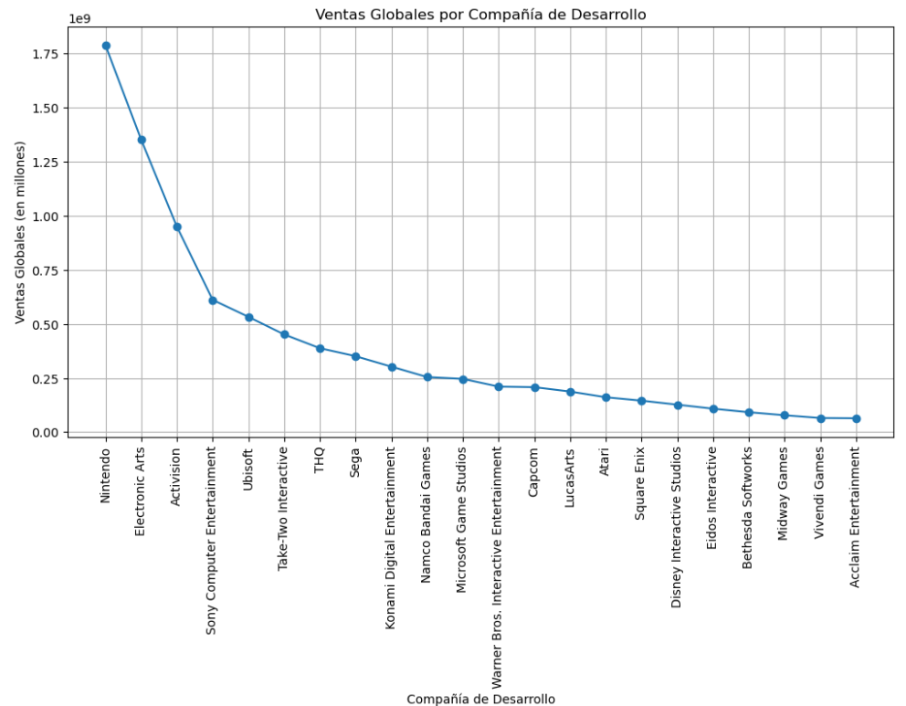

### 6.5.1 Relevant information:

Most development companies have an average global sales of less than 500,000 copies.
The Development Companies that sell the most are:
-Nintendo.
- Electroni Arts.
- Activision.
-Sony.
- Ubisoft.

---

# 7. DEA Results

To relate the analyses to data modelling, the strengths of the type of analysis according to the objective of the project are summarised:


- **Global Sales Correlation Analysis by Console and Genre:**

  - The correlation between the attributes of the DataFrame df_juegos can be examined.
  - The positive correlation between the 'Ventas_Globales', 'Ranking' and the 'Puntuacion_Reseña' can be identified.
  - It can be evaluated that video games with higher review scores tend to have more overall sales and that can be used as an objective variable to define the Video Game, considering the reviews and the ranking that the player can have when playing a video game, and how it can develop a gaming experience focused on the educational experience.
  - In conclusion, this data can be used to determine in which genre of the video game the video game should be developed.
  
  
  
- **Global Video Game Sales Analysis by Platform:**

  - You can examine the distribution of video game sales according to the platform or console on which they are played.
  - You can identify which platforms are most popular in terms of sales.
  - It is possible to evaluate which platforms are most suitable for the Video Game, considering the technical and usability characteristics required to offer an effective educational experience.
  - In conclusion, this data can be used to determine which platforms the Video Game should be developed and distributed on.
  
  
  

- **Global Sales Analysis by Genre:**
  - The distribution of video game sales by genre can be examined.
  - You can identify the most popular video game genres in terms of sales.
  - It is possible to evaluate which genres are relevant to the Video Game, considering the educational or informational objective of the game.
  - In conclusion, this data can be used to determine which genre of video game has the greatest potential for acceptance and success in the market.
  
  
  

- **Global Sales Analysis by Development Company:**

  - The distribution of video game sales according to the development company can be examined.
  - You can identify which companies have a successful track record in terms of video game sales.
  - Possible partnerships or collaborations with these companies for the development and distribution of the Video Game may be evaluated.
  - In conclusion, this data can be used to select a development company with experience in the selected game genre and platform.


By combining these analyses, a more complete view can be obtained and supported by data on the type of genre and platform most suitable for the development of the Video Game. These analyses will provide insights into player preferences, market trends, and opportunities to achieve success in terms of sales and acceptance of the game. And validate the implementation of the predictive model based on 'Genre', 'Platform' and 'Ventas_Globales' **"if the development of a Video Game can be successful"**.

---


# 8. Conclusion

In the analysis of the data, three different types of predictive models were evaluated: a classification model, a linear regression model, and a logistic regression model. Each of these models has its usefulness and is useful in different contexts.

However, based on the results obtained and the specific objective of this project, it is concluded that the linear regression model is the most suitable to predict the global sales of a video game based on attributes such as genre, platform and game development company. The other two models, classification and logistic regression, proved to have difficulties in making accurate predictions in the context of this problem, since the first had problems predicting the genre of a video game and the second to predict whether a video game would be successful.

Although some useful results were obtained, it is clear that there is room for improvement in these models. Specifically, it would be useful to explore other characteristics that could influence the overall sales of a video game, such as the game's release date, the ratings received by the game, or even the presence of certain characters or themes in the game. It can also be useful to try different types of models, such as decision trees, vector support machines, or artificial neural networks, which may be more effective in certain contexts.

It would also be beneficial to collect more data and possibly adjust the parameters of the models to improve the accuracy of the predictions. However, the collection of additional data should always be done ethically and with proper consent, and it should be noted that over-tweaking models can lead to overfitting, where the model performs very well on training data, but poorly on test data.

In summary, although the linear regression model was the one that gave the best results in this project, there is a lot of room for improvement and to explore other options. Data analysis and modeling are iterative processes, and there's always room to learn, improve, and test new ideas.


---

# 9. References

- Official Python documentation: https://docs.python.org/3/
- Official Pandas documentation: https://pandas.pydata.org/docs/
- Matplotlib Official Documentation: https://matplotlib.org/stable/contents.html
- Official Seaborn documentation: https://seaborn.pydata.org
- Official Scikit-learn documentation: https://scikit-learn.org/stable/
- Official Nupy documentation: https://numpy.org/doc/stable/
- Exploratory Data Analysis https://www.aprendemachinelearning.com/analisis-exploratorio-de-datos-pandas-python/
- Concepts in Python https://www.geeksforgeeks.org
- Doubts https://stackoverflow.com/questions/tagged/pandas+python
- Data analysis https://ocw.uc3m.es/course/view.php?id=230
- Data Dictionaries in Data Frame https://github.com/nsheikh23/COVID_StockMarket_Analysis/blob/master/52_Week.ipynb
- Data frame processing in pandas https://barcelonageeks.com/eliminar-una-o-varias-columnas-de-pyspark-dataframe/
- Data Clean https://github.com/mramshaw/Data-Cleaning
- Data plotting https://github.com/tomimester/python-histogram/blob/master/plot-histogram-python-pandas.ipynb
- Data Cleaning in Python: the Ultimate Guide (2020) https://towardsdatascience.com/data-cleaning-in-python-the-ultimate-guide-2020-c63b88bf0a0d
- Linear Regression in Python: A Detailed Analysis https://www.cienciadedatos.net/documentos/py10-regresion-lineal-python.html
- Applying Machine Learning to predict video game successes https://www.saturdays.ai/projects/Videojuegos.html
- Machine Learning for sales prediction https://www.aprendemachinelearning.com/regresion-lineal-en-espanol-con-python/
- McKinney, Wes. Python for Data Analysis. O'Reilly Media, Inc, 2017.
- VanderPlas, Jake. Python Data Science Handbook: Essential Tools for Working with Data. O'Reilly Media, Inc, 2016.

---
